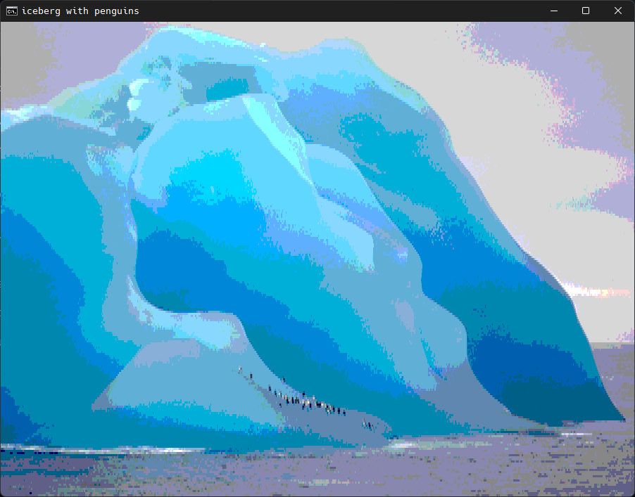

# imgview
converts images to ANSI art and displays in terminal 
also available as an executable <a href="https://github.com/at-adityavikram/imgview/releases/download/1/imgview.zip">here</a>.

right click an image file > open with > imgview.exe

wanna use the .py file? 
open terminal > imgview.py "filename.png" > done

obviously, your preferred terminal needs to support ANSI (needs to be manually enabled in the registry in windows)

